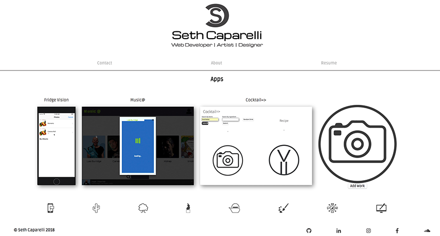

# Seth Caparelli's Personal portfolio app

Visit the site [here](http://seth-caparelli.surge.sh)

A showcase of all of my work including recent app builds as well as my past fine art.  The front end was built using React while the back end' technologies include: Node.js, Express, Knex.js, PostgreSQL, and Heroku.  You can find the code for the server [here](https://github.com/SethCaparelli/portfolio-app-backend)

To showcase the photos and gifs of my work, I used a couple of libraries. On being an image lightbox and the other being a responsive modal.  These kept the application to a singe page and were very useful in presenting larger images and information.